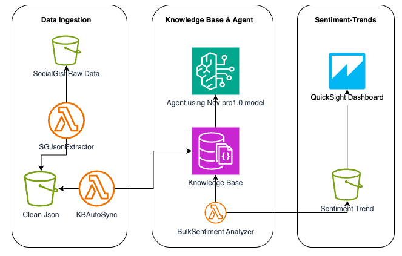

# Streaming Service Portfolio Sentiment Analysis Platform

> **Enterprise serverless sentiment analysis pipeline for streaming services using AWS Lambda, Bedrock, and QuickSight**

[](https://aws.amazon.com/)
[](https://python.org/)
[](https://aws.amazon.com/bedrock/)
[](https://aws.amazon.com/quicksight/)

## 🎯 Project Overview

This project demonstrates a complete **serverless sentiment analysis pipeline** built for analyzing customer feedback across multi-brand streaming service portfolios. The system can analyze sentiment for any streaming platform including major services, niche networks, and specialized content providers.

### Key Features
- **Automated Data Processing**: Raw social media data → cleaned, structured insights
- **AI-Powered Analysis**: AWS Bedrock integration with Nova Pro for sentiment classification
- **Real-time Dashboards**: QuickSight visualizations for executive decision-making
- **Scalable Architecture**: Serverless design handles variable data volumes
- **Cost Optimized**: Pay-per-use model with intelligent resource management

## 🏗️ Architecture




## 📊 Business Impact

### Analytics Capabilities
- **Portfolio Performance**: Track sentiment across multiple streaming properties
- **Competitive Intelligence**: Compare performance against major platforms
- **Theme Analysis**: Identify content quality, pricing, and technical issues
- **Executive Insights**: Priority-ranked action items with confidence scoring

### Sample Insights
- **Premium Streaming Service**: 73% positive sentiment (2,450 mentions) - trending up
- **Niche Content Platform**: 45% negative sentiment - action needed on pricing concerns
- **Technical Issues**: 15% of mentions cite buffering problems across portfolio

## 🛠️ Technology Stack

### AWS Services
- **Lambda**: Serverless compute for data processing and analysis
- **S3**: Scalable storage for raw data, processed files, and results
- **Bedrock**: AI/ML foundation models for sentiment analysis
- **QuickSight**: Business intelligence and visualization
- **CloudWatch**: Monitoring and logging

### Languages & Tools
- **Python 3.9+**: Core processing logic
- **Boto3**: AWS SDK integration
- **JSON/JSONL**: Data interchange formats
- **Mermaid**: Architecture diagrams

## 🚀 Quick Start

### Prerequisites
- AWS Account with Bedrock access
- Python 3.9+
- AWS CLI configured
- Terraform (optional, for infrastructure)

### Setup Instructions

1. **Clone Repository**
```bash
git clone https://github.com/riteshgupta828/streaming-sentiment-analysis
cd streaming-sentiment-analysis
```

2. **Deploy Infrastructure**
```bash
# Using AWS CLI
aws cloudformation deploy --template-file infrastructure/cloudformation.yaml --stack-name streaming-sentiment-stack

# Or using Terraform
cd infrastructure/terraform
terraform init && terraform apply
```

3. **Configure Lambda Functions**
```bash
# Update configuration in each Lambda function
vim lambda/config.py
```

4. **Upload Sample Data**
```bash
aws s3 cp sample-data/ s3://your-bucket/reddit/socialgist-raw/ --recursive
```

5. **Trigger Processing**
```bash
# Manual trigger for testing
aws lambda invoke --function-name SGJsonExtractor-RawtoClean response.json
```

## 📁 Project Structure

```
streaming-sentiment-analysis/
├── README.md
├── architecture/
│   ├── system-diagram.md
│   └── data-flow.md
├── lambda/
│   ├── data-cleaner/
│   │   ├── lambda_function.py
│   │   ├── requirements.txt
│   │   └── README.md
│   ├── kb-autosync/
│   │   ├── lambda_function.py
│   │   ├── requirements.txt
│   │   └── README.md
│   └── sentiment-analyzer/
│       ├── lambda_function.py
│       ├── requirements.txt
│       └── README.md
├── infrastructure/
│   ├── cloudformation.yaml
│   ├── terraform/
│   └── iam-policies.json
├── dashboards/
│   ├── quicksight-templates/
│   └── sample-visualizations/
├── sample-data/
│   ├── raw-socialgist-sample.json
│   └── expected-output.json
├── docs/
│   ├── setup-guide.md
│   ├── troubleshooting.md
│   └── api-reference.md
└── tests/
    ├── unit/
    └── integration/
```

## 🔧 Configuration

### Environment Variables
```bash
# Lambda Environment Variables
KNOWLEDGE_BASE_ID=YOUR_KB_ID_HERE
DATA_SOURCE_ID=YOUR_DATA_SOURCE_ID_HERE
S3_BUCKET=your-streaming-sentiment-bucket
MIN_MENTIONS_THRESHOLD=3
```

### S3 Bucket Structure
```
your-streaming-sentiment-bucket/
├── reddit/socialgist-raw/          # Raw input data
├── socialgist-processed/           # Cleaned data
├── socialgist-kb/                  # Knowledge base ready files
└── sentiment-trend-analyzer/       # Analysis results
```

## 📈 Performance Metrics

### Processing Capabilities
- **Data Volume**: 10K+ feedback entries per batch
- **Processing Time**: ~2-3 minutes end-to-end
- **Accuracy**: 85%+ sentiment classification confidence
- **Cost**: ~$0.05 per 1K records processed

### Scalability
- **Concurrent Processing**: Auto-scales with S3 event triggers
- **Storage**: Unlimited with S3 lifecycle policies
- **Analysis**: Bedrock handles variable AI workloads

## 🎨 Dashboard Previews

### Executive Summary Dashboard


### Property Performance Matrix


### Sentiment Trends Over Time


## 🧪 Testing

### Unit Tests
```bash
cd tests/unit
python -m pytest test_data_cleaner.py -v
python -m pytest test_sentiment_analyzer.py -v
```

### Integration Tests
```bash
cd tests/integration
python test_end_to_end.py
```

### Load Testing
```bash
# Test with 10K sample records
python tests/load/generate_test_data.py --records 10000
```

## 📚 Documentation

- **[Setup Guide](docs/setup-guide.md)**: Detailed deployment instructions
- **[API Reference](docs/api-reference.md)**: Lambda function parameters
- **[Troubleshooting](docs/troubleshooting.md)**: Common issues and solutions
- **[Architecture Deep Dive](docs/architecture.md)**: Technical implementation details

## 🔍 Use Cases

### Business Applications
1. **Executive Reporting**: Monthly sentiment trends for C-suite
2. **Product Management**: Feature request analysis and prioritization
3. **Customer Success**: Proactive issue identification and resolution
4. **Competitive Analysis**: Market positioning insights

### Technical Applications
1. **MLOps Pipeline**: Model training data preparation
2. **Data Engineering**: ETL pipeline demonstration
3. **Serverless Architecture**: Event-driven processing patterns
4. **AI Integration**: Bedrock and LLM implementation

### Industry Applications
- **Media & Entertainment**: Multi-platform content analysis
- **Technology**: SaaS platform feedback monitoring
- **Retail**: E-commerce platform sentiment tracking
- **Finance**: Fintech app user sentiment analysis

## 🤝 Contributing

We welcome contributions! Please see our [Contributing Guide](CONTRIBUTING.md) for details.

### Development Workflow
1. Fork the repository
2. Create a feature branch (`git checkout -b feature/amazing-feature`)
3. Commit your changes (`git commit -m 'Add amazing feature'`)
4. Push to the branch (`git push origin feature/amazing-feature`)
5. Open a Pull Request

## 📄 License

This project is licensed under the MIT License - see the [LICENSE](LICENSE) file for details.

## 👨‍💻 Author

**Your Name**
- LinkedIn: [Ritesh Gupta](https://linkedin.com/in/riteshgupta828/)
- Email: gritesh@gmail.com

## 🙏 Acknowledgments

- AWS Bedrock team for foundation model access
- Open source community for various libraries and tools
- Streaming industry for inspiring innovative analytics solutions

## 📊 Project Stats


## 📝 Disclaimer

This project is a demonstration of serverless analytics architecture and is not affiliated with any specific streaming service provider. All sample data and analysis examples are fictional and created for educational purposes.

---

⭐ **Star this repo if you found it helpful!** ⭐
