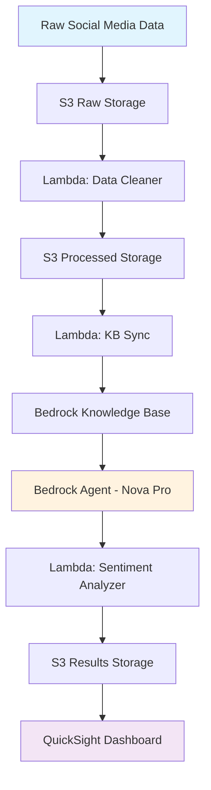

# Streaming Service Portfolio Sentiment Analysis Platform

> **Enterprise-grade sentiment analysis pipeline for multi-brand streaming portfolios using AWS serverless architecture**

## 🏗️ Architecture

